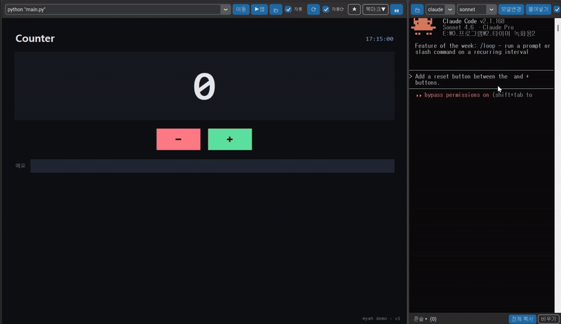

# myah (먀)


> A lightweight **Windows** dev cockpit: a real embedded Chrome preview on the left, a coding-agent terminal (Claude Code / Codex) on the right — wired together so the agent can **see and drive** the page (and even **native desktop apps**).
>
> 왼쪽엔 **진짜 크롬 미리보기**, 오른쪽엔 **코딩 에이전트 터미널**(Claude Code / Codex)을 한 창에 띄우고, 에이전트가 그 페이지(그리고 **네이티브 데스크톱 앱**)를 **직접 보고 조작**할 수 있게 연결한 가벼운 윈도우 개발 도구.

> **이름의 유래 / Origin of the name:** 한글 입력기를 켠 채로 `AI`를 치면 **"먀"** 가 나온다. 거기서 따왔고, 로마자로 `myah`. (Type `AI` with the Korean IME on and you get **"먀"** — hence `myah`.)



---

## Why I built this

I build a lot of things solo, and the constant back-and-forth between editor and browser was the friction I wanted gone. So I made a workbench where I just point it at a folder, see the live result on the left, and fix things with a coding agent on the right — without leaving the window.

The key part isn't the agent or the screenshots. It's the loop: **edit the work in that folder → see the result immediately in the left preview.** That's the whole reason this exists.

And because it only asks for a *folder* and a *URL*, it isn't tied to any one project. Point it at anything you can run on a local server — a React app, a Flask backend, a static page, someone else's repo — and the same loop just works. A general workbench, not a project-specific tool.

## 왜 만들었나

혼자서 이것저것 많이 만드는데, 매번 **에디터 ↔ 브라우저**를 왔다갔다 하는 게 제일 거슬렸다. 그래서 폴더만 가리키면 왼쪽에서 결과를 바로 보고, 오른쪽 코딩 에이전트랑 같이 고치는 — 창을 벗어나지 않는 작업대를 만들었다.

핵심은 에이전트도 캡처도 아니다. **그 폴더의 작업물을 고치면 → 왼쪽 미리보기로 즉시 확인되는** 그 왕복, 그거 하나 때문에 만들었다.

그리고 **폴더 경로와 URL만** 받기 때문에 특정 프로젝트에 묶이지 않는다. 로컬 서버로 띄울 수 있는 거면 무엇이든 — React 앱이든 Flask 백엔드든 정적 페이지든 남의 레포든 — 경로만 불러오면 똑같은 루프가 그대로 돈다. 특정 작업용이 아니라 **범용 작업대**다.

---

## What makes it different (for programmers)

Most "AI coding GUI" tools wrap a *webview* (Electron / Tauri / WebView2) and talk to a model. myah's bet is different on two axes:

- **It embeds real OS windows, not a webview.** The left pane is the *actual* Chrome process (your real extensions, logins, cookies, DevTools) reparented via Win32; the right pane is a *real* `conhost` running the agent's native TUI. No emulation layer — so there's nothing to be "almost like Chrome." It just *is* Chrome.
- **It can preview native desktop apps — not just web.** Give it `python main.py` and it embeds *that program's own window* on the left. A webview structurally cannot do this; it only renders web content. If you build Tkinter/PyQt/desktop GUIs, this is the part that has almost no alternative.

The trade is honest and stated plainly below in *"Why reparenting"*: you give up cross-platform and some stability (Windows-only, DPI/IME/clipping are fought, not free) in exchange for full fidelity and native-window embedding. If you only ever preview web apps, a webview tool is the saner pick. If your loop is **edit source → see the real thing (web *or* native) → repeat**, with an agent doing the edits, that's the gap myah fills.

What that buys you in practice:
- **One window, one loop.** Point at a folder → live preview left, agent right → edit, re-run (or auto-reload), see the result. No alt-tabbing.
- **The agent can actually *see* the page** (via MCP/CDP), not just write blind diffs.
- **Resumable** across sessions/models (`.myah/PROGRESS.md`), and **reversible** (isolated git snapshots that never touch your real history).
- **Self-healing** — if the agent CLI install breaks, myah detects it (`<engine> --version`) and auto-reinstalls (up to 2 tries) before launching.

## What you can do with it

It looks like a coding GUI, but the building blocks — **real browser + agent terminal + native-app embedding + per-project launchers** — make it a general **automation cockpit**:

- **App / UI development** — build a desktop or web UI with the agent, see each change live on the left (turn on auto-reload and it re-runs ~6s after the agent stops editing).
- **Web automation** — the agent drives a real logged-in Chrome (fill forms, click, scrape, post) through MCP, while you watch.
- **Per-project environments** — `런처생성` drops a `run_ai.bat` in any folder so you can reopen *that* project in the same set-up later; the parent stays the single source, so it never goes stale.
- **Unattended runs** — with "allow all" mode plus snapshots as a safety net, the agent can grind through a task list while you watch the left pane.

Because it only needs a *folder* + a *run target*, the workflow is the same whether the project is a React app, a Flask API, someone else's repo, or a native Tkinter tool.

## 무엇이 다른가 (프로그래머 입장에서)

대부분의 "AI 코딩 GUI" 도구는 *webview*(Electron / Tauri / WebView2) 를 감싸 모델과 대화한다. myah 는 두 축에서 다르게 건다:

- **webview 가 아니라 진짜 OS 창을 임베드한다.** 왼쪽은 *진짜* 크롬 프로세스(내 확장·로그인·쿠키·DevTools 그대로)를 Win32 로 reparent 한 것이고, 오른쪽은 에이전트 TUI 가 네이티브로 도는 *진짜* `conhost` 다. 에뮬레이션 층이 없으니 "크롬 비슷한 것"이 아니라 그냥 크롬이다.
- **웹뿐 아니라 네이티브 데스크톱 앱을 미리볼 수 있다.** `python main.py` 를 주면 *그 프로그램의 창*을 왼쪽에 박는다. webview 는 구조적으로 못 하는 일(웹 콘텐츠만 렌더). Tkinter/PyQt 같은 데스크톱 GUI 를 만든다면, 이건 거의 대안이 없는 부분이다.

맞교환은 아래 *"왜 reparenting 인가"* 에 솔직히 적어뒀다: 크로스플랫폼과 일부 안정성(윈도우 전용, DPI/IME/클리핑은 공짜가 아니라 싸워서 잡은 것)을 내주고, 충실도와 네이티브 창 임베딩을 얻는다. 웹만 미리본다면 webview 도구가 합리적이다. 하지만 너의 루프가 **소스 고치기 → 진짜 결과(웹이든 네이티브든) 보기 → 반복** 이고 그 고치는 일을 에이전트가 한다면, 그 빈틈을 myah 가 메운다.

실제로 얻는 것:
- **한 창, 한 루프.** 폴더 가리키면 → 왼쪽 라이브 미리보기, 오른쪽 에이전트 → 고치고, 재실행(또는 자동 재실행), 결과 확인. alt-tab 없음.
- **에이전트가 페이지를 실제로 *본다*** (MCP/CDP) — 깜깜이 diff 가 아니라.
- 세션·모델 넘어 **이어서** (`.myah/PROGRESS.md`), 잘못돼도 **되돌림** (네 실제 히스토리를 안 건드리는 격리 git 스냅샷).
- **자가복구** — 에이전트 CLI 설치가 깨지면 myah 가 감지(`<engine> --version`)해 최대 2회 자동 재설치 후 실행.

## 무엇을 할 수 있나

겉은 코딩 GUI 지만, 구성 요소 — **진짜 브라우저 + 에이전트 터미널 + 네이티브 앱 임베딩 + 프로젝트별 런처** — 가 합쳐지면 범용 **자동화 코크핏**이 된다:

- **앱 / UI 개발** — 에이전트와 데스크톱·웹 UI 를 만들고, 변화를 왼쪽에서 즉시 확인 (자동 재실행 켜면 에이전트가 편집을 멈춘 뒤 ~6초에 재실행).
- **웹 자동화** — 에이전트가 로그인된 진짜 크롬을 MCP 로 조작(폼 입력·클릭·스크랩·포스팅)하는 걸 지켜본다.
- **프로젝트별 환경** — `런처생성` 이 아무 폴더에나 `run_ai.bat` 을 심어, 나중에 *그 프로젝트*를 같은 세팅으로 다시 연다. 부모가 단일 소스라 낡지 않는다.
- **무인 실행** — "모두 허용" 모드 + 스냅샷 안전판으로, 에이전트가 작업 목록을 갈아넣는 동안 왼쪽만 지켜본다.

*폴더* + *실행 대상* 만 있으면 되므로, 프로젝트가 React 앱이든 Flask API 든 남의 레포든 네이티브 Tkinter 도구든 흐름은 똑같다.

---

## English

### What it is
A single Tkinter (customtkinter) window that **reparents real OS windows** into two panes:

- **Left** — a real Google Chrome window (its own tabs, back/forward, DevTools), embedded and clipped into the pane. Used as a live preview of your local app.
- **Right** — a real console running `claude` (Claude Code) or `codex` (OpenAI Codex CLI), selectable from a dropdown.
- **Bridge** — Chrome is launched with remote debugging, so the app can capture console errors, do real reloads, take screenshots, and expose browser control to the agent over **MCP**.

Unlike Electron/extension-based tools, this embeds the **actual** browser and console windows, so you get the real thing with very little rendering code.

### Features
- Real Chrome preview embedded in-window (tabs, DevTools, extensions all work)
- **Run-app preview** — besides a URL, give a run command (e.g. `python main.py`) and myah launches that app and embeds **its native window** on the left; ⟳ re-runs it with your latest code. Works for desktop GUIs (Tkinter/PyQt) and web dev servers alike — you edit the source (you or the agent), re-run, and see the result, same loop for any project type
- Right pane runs **Claude Code** or **Codex CLI** (toggle, remembered)
- **Console panel** — collects page errors/exceptions/failed requests via CDP, with per-item and "copy all" buttons
- **Real reload** (⟳) via CDP — keeps tabs/state
- **📷 Capture** — full page or drag-select a region; saves to `<project>/캡처/<name>.png` and copies the path to the clipboard
- **Agent browser control via MCP** (`myah_mcp_server.py`): the agent can read the page, type, click, and screenshot it
- Korean IME works in the terminal (console runs as a top-level owned window)
- **Session continuity** — auto-creates `.myah/PROGRESS.md` (done / next / last state) and tells the agent (via `AGENTS.md`/`CLAUDE.md`) to read and update it, so you can resume work across sessions or models
- **"Allow all" (YOLO) mode** — optional checkbox to run the agent without permission prompts (`claude --dangerously-skip-permissions` / `codex --dangerously-bypass-approvals-and-sandbox`), with a warning to back up first
- **Snapshots / undo** — `git backup` (isolated tag snapshot that never touches your branches/history) or `folder backup` (copy to `.myah/snapshots/`, heavy dirs excluded); restore from a list, and the restore is auto-noted in `.myah/PROGRESS.md` so the agent isn't confused

### Requirements
- **Windows 10/11** (this tool is Windows-only — it relies on native window embedding)
- **Python 3.10+** — install from python.org and check "Add Python to PATH" during install. *(Built & tested on 3.11; other 3.10+ versions should work.)*
- **Google Chrome** installed
- For the agent: **Claude Code** (`claude`) and/or **Codex CLI** (`codex`) on your PATH

### Install & run
```bat
:: 1) one-time setup: double-click install.bat
::    (creates .venv, installs deps, optional desktop shortcut)
install.bat

:: 2) launch anytime: double-click run.bat
run.bat
```
Manual setup instead of install.bat:
```bat
python -m venv .venv
.venv\Scripts\python -m pip install -r requirements.txt
.venv\Scripts\python myah.py
```

### Usage
1. Left: type a URL (e.g. `localhost:3000`) and press **이동/Enter** -> Chrome embeds in the pane.
2. Right: pick a folder (your project), choose engine (`claude`/`codex`), press **▶ 시작**.
3. The app writes a project-scoped `.mcp.json` so Claude Code auto-loads the browser tools. On first launch Claude Code asks you to approve the MCP server — approve it. Check with `/mcp` (you should see `myah-browser`).
4. Now you can ask the agent things like *"check the console errors and fix them"*, *"type 안녕 into the search box"*, or *"screenshot the page and tell me what's wrong"*.

### Agent tools (MCP)
`myah_mcp_server.py` exposes, over stdio MCP:
- `browser_snapshot` — page title/URL + interactive elements with refs
- `browser_type(ref, text)` — type into an element (React-friendly)
- `browser_click(ref)` — click an element
- `browser_screenshot(full=True, ref, x, y, width, height)` — capture the page (full by default; region by element ref or coordinates) and return it to the agent

### Architecture
```
Tkinter (customtkinter) window
 |- Left  : real Chrome window  (reparented, clipped, CDP remote-debugging)
 |            +- CDP -- console capture / reload / screenshot
 +- Right : real console        (claude / codex)
              +- Claude Code -- MCP (.mcp.json) --> myah_mcp_server.py -- CDP --> the same Chrome
```

### Why reparenting (instead of webview / Electron)?
Most tools in this space embed a *webview* (Electron, Tauri, WebView2) — a browser-engine component designed to be embedded. myah instead **reparents the real OS windows** of an already-running Chrome and a real console (`conhost`) into one Tkinter window, using the Win32 `SetParent` family.

The conventional advice is the opposite: **don't reparent, use a webview.** That advice is correct — *for showing web content*. A webview is purpose-built for embedding and is more stable and cross-platform. So why go the other way?

**Because a webview can't embed a native desktop app.** The core feature here is the *run-app preview*: point myah at `python main.py` and it embeds **that program's actual window** (a Tkinter/PyQt GUI, etc.) on the left. No webview can do that — they only render web content. Reparenting was the only path that satisfied the requirement, so myah pays the price for it.

**That price is real, and worth stating honestly:**
- **Windows-only.** Win32 reparenting doesn't port to macOS/Linux.
- **Inherently flaky.** Cross-process `SetParent` is officially "works, but with caveats" — DPI-awareness mismatches between the two windows cause repaint/jitter, higher-integrity (UIPI) windows can refuse to be reparented, and the API was really designed for windows *within one process*. The jitter, IME, clipping, focus, and shutdown-cleanup work in this codebase is all the cost of fighting that.
- **Fragile to upstream changes.** If Chrome or Windows changes window structure or policy, the embedding can break (the same way IE-frame reparenting died when IE was retired).

**What you get in return:**
- **100% fidelity** — it's the *actual* Chrome (your extensions, logins, DevTools) and the *actual* console (the agent's TUI renders natively), not an emulation.
- **Native-app preview** — the one thing webview-based tools structurally cannot do.
- **Light core** — myah borrows existing windows instead of shipping a browser engine.

So this is not "the right way" in general — it's a deliberate trade: give up cross-platform and easy stability to gain native-window embedding. If you only ever preview web apps, a webview tool is the saner choice. If you build and preview **desktop GUIs** alongside an AI agent on Windows, this fills a gap almost nothing else does. The code is also, by necessity, a worked example of doing Win32 cross-process embedding (Chrome + console) with the DPI/IME/clipping pitfalls actually handled — treat it as experimental and environment-sensitive.

### Extending myah — it's a platform, not a one-off

myah is deliberately built around one rule: **every built-in feature must be common to *all* projects.** Anything project-specific lives in the folder, not in the app. That keeps the core small and turns myah into a substrate you can build on:

- **Per-project config & memory** live in each folder's `.myah/` (`run`, `PROGRESS.md`, snapshots) — myah just reads them. Drop those files into any folder and that folder "becomes" a myah project, with no coupling to the app.
- **Per-project launchers** — `run_ai.bat` (generated by the *Make launcher* button) reopens any folder in the same environment, while the parent install stays the single source of truth (never goes stale).
- **Agent tooling is MCP-based** (`myah_mcp_server.py`) — the browser bridge is a standard MCP server, so you can add your own tools/servers the same way without touching myah's core.
- **Agent behavior is steered by plain files** (`AGENTS.md` / `CLAUDE.md`, `PROGRESS.md`) that myah writes into the folder — so you can shape how the agent works per project by editing text, not code.
- **The preview accepts any run target** — a URL, a dev server, a `.bat`, or `python main.py`. New project types need no new myah code.

Because of this, the same loop scales from "fix a React bug" to larger ideas: a **goal-driven build loop** (spec + target screenshots in `.goal/`, an agent that builds toward them, a second "judge" model that diffs result vs. target), unattended task runs (allow-all mode + snapshots as the safety net), or wiring myah as the cockpit for content/automation pipelines you already run. None of that requires changing myah — it's all layered into the project folder.

### Roadmap (ideas, not promises)
- File-watch auto-reload tuning (per-project quiet interval)
- Pluggable "judge" model for visual diffing (goal-driven loop)
- Optional multi-pane / multi-session layouts
- A short gallery of `.myah/` project templates

Contributions and issues welcome — especially Win32/embedding edge cases on different DPI and multi-monitor setups.

### Security notes
- Chrome is launched with `--remote-debugging-port` bound to **127.0.0.1** (localhost only), on an ephemeral port, using a **dedicated profile** (`.myah-chrome-profile/`) that is isolated from your normal Chrome.
- The debug port lets local processes control that Chrome instance. Don't run this on an untrusted shared machine.

### Disclaimer
This is an **unofficial, community project** and is **not affiliated with or endorsed by Anthropic or OpenAI**. "Claude" and "Codex" are referenced only as the CLIs this tool launches.

### License
MIT — see [LICENSE](LICENSE).

---

## 한국어

### 무엇인가
하나의 Tkinter(customtkinter) 창에 **진짜 OS 창들을 reparent**해서 두 패널로 붙인 도구입니다.

- **왼쪽** — 진짜 구글 크롬 창(자체 탭·뒤로가기·DevTools)을 패널에 임베드·클리핑. 로컬 앱 라이브 미리보기로 사용.
- **오른쪽** — `claude`(Claude Code) 또는 `codex`(OpenAI Codex CLI)를 띄우는 진짜 콘솔. 드롭다운으로 선택.
- **다리** — 크롬을 원격 디버깅으로 띄워, 콘솔 에러 수집·진짜 리로드·스크린샷, 그리고 **MCP**로 에이전트가 브라우저를 조작하게 연결.

Electron/확장 기반과 달리 **실제** 브라우저·콘솔 창을 그대로 박아서, 적은 렌더링 코드로 진짜 환경을 얻습니다.

### 기능
- 진짜 크롬 미리보기 임베드(탭·DevTools·확장 전부 동작)
- **앱 실행 미리보기** — URL 대신 실행 명령(예: `python main.py`)을 주면 그 앱을 실행해 **네이티브 창**을 왼쪽에 임베드; ⟳ 로 최신 코드로 재실행. 데스크톱 GUI(Tkinter/PyQt)든 웹 dev 서버든 동일하게 — 소스를 고치고(사람이든 에이전트든) 재실행해 결과 확인, 프로젝트 종류를 가리지 않는 같은 루프
- 오른쪽에서 **Claude Code / Codex** 토글(마지막 선택 기억)
- **콘솔 패널** — CDP로 페이지 에러·예외·실패 요청 수집, 항목별/전체 복사 버튼
- **진짜 리로드(⟳)** — 탭·상태 유지
- **📷 캡처** — 전체 페이지 또는 드래그 구간 선택 -> `<프로젝트>/캡처/<이름>.png` 저장 + 경로 클립보드 복사
- **에이전트의 브라우저 조작(MCP)** — 페이지 보기·입력·클릭·스크린샷
- 터미널 한글 IME 정상(콘솔을 top-level 창으로 띄움)
- **작업 연속성** — `.myah/PROGRESS.md`(한 일/할 일/마지막 상태)를 자동 생성하고, 에이전트가 그것을 읽고 갱신하도록 `AGENTS.md`/`CLAUDE.md`에 지시문을 넣어줌 → 세션·모델이 바뀌어도 이어서 작업
- **'모두 허용'(YOLO) 모드** — 권한 확인 없이 에이전트를 끝까지 진행시키는 선택 체크박스 (`claude --dangerously-skip-permissions` / `codex --dangerously-bypass-approvals-and-sandbox`), 켤 때 백업 경고
- **스냅샷 / 되돌리기** — `git백업`(브랜치·히스토리를 건드리지 않는 격리 태그 스냅샷) 또는 `폴더백업`(`.myah/snapshots/`에 복사, 무거운 폴더 제외); 목록에서 골라 복원하고, 복원 사실은 `.myah/PROGRESS.md`에 자동 기록되어 에이전트가 헷갈리지 않음

### 요구사항
- **Windows 10/11** (네이티브 창 임베딩 기반이라 윈도우 전용)
- **Python 3.10+** — python.org 에서 설치하고 설치 시 "Add Python to PATH" 체크. *(3.11 에서 개발·테스트했지만 3.10+ 면 동작.)*
- **Google Chrome** 설치
- 에이전트용: **Claude Code**(`claude`) / **Codex CLI**(`codex`) 가 PATH에

### 설치 & 실행
```bat
:: 1) 최초 1회 설치: install.bat 더블클릭
::    (.venv 생성 + 의존성 설치 + 바탕화면 바로가기 선택)
install.bat

:: 2) 이후 실행: run.bat 더블클릭
run.bat
```
install.bat 대신 수동 설치:
```bat
python -m venv .venv
.venv\Scripts\python -m pip install -r requirements.txt
.venv\Scripts\python myah.py
```

### 사용법
1. 왼쪽에 URL(예: `localhost:3000`) 입력 후 **이동/Enter** -> 크롬이 패널에 임베드.
2. 오른쪽에서 폴더(프로젝트) 선택, 엔진(`claude`/`codex`) 고른 뒤 **▶ 시작**.
3. 앱이 프로젝트에 `.mcp.json`을 자동 생성해 Claude Code가 브라우저 툴을 자동 로드합니다. 첫 실행 때 MCP 서버 승인 프롬프트가 뜨면 승인하세요. `/mcp`로 `myah-browser` 확인.
4. 이제 *"콘솔 에러 확인하고 고쳐줘"*, *"검색창에 안녕 입력해줘"*, *"화면 캡처해서 뭐가 문제인지 봐줘"* 처럼 시킬 수 있습니다.

### 에이전트 툴 (MCP)
`myah_mcp_server.py` 가 stdio MCP 로 제공:
- `browser_snapshot` — 페이지 제목/URL + 상호작용 요소들(ref 포함)
- `browser_type(ref, text)` — 요소에 입력(React 호환)
- `browser_click(ref)` — 요소 클릭
- `browser_screenshot(full=True, ref, x, y, width, height)` — 페이지 캡처(기본 전체, ref/좌표로 구간 지정) -> 에이전트에 이미지 반환

### 왜 reparenting 인가 (webview / Electron 대신)?
이 분야 대부분의 도구는 *webview*(Electron, Tauri, WebView2) — 임베드용으로 설계된 브라우저 엔진 컴포넌트 — 를 박습니다. myah는 대신 이미 떠 있는 **진짜 크롬 창**과 **진짜 콘솔(`conhost`) 창**을 Win32 `SetParent` 계열로 **하나의 Tkinter 창에 reparent** 합니다.

업계의 통념은 정반대입니다: **reparenting 하지 말고 webview 써라.** 그 조언은 *웹 콘텐츠를 보여줄 때는* 맞습니다. webview는 임베드가 본래 목적이라 더 안정적이고 크로스플랫폼이죠. 그런데 왜 반대로 갔나?

**webview로는 네이티브 데스크톱 앱을 임베드할 수 없기 때문입니다.** 여기 핵심 기능은 *앱 실행 미리보기*예요 — myah에 `python main.py`를 주면 **그 프로그램의 실제 창**(Tkinter/PyQt GUI 등)을 왼쪽에 박습니다. webview는 이걸 못 합니다. 웹 콘텐츠만 렌더하니까요. reparenting만이 그 요구를 충족하는 유일한 길이었고, myah는 그 대가를 치릅니다.

**그 대가는 실재하고, 솔직히 적어 둡니다:**
- **윈도우 전용.** Win32 reparenting 은 macOS/Linux 로 안 옮겨집니다.
- **본질적으로 불안정.** 크로스 프로세스 `SetParent` 는 공식적으로 "되긴 하는데 주의사항이 있는" 영역이에요 — 두 창의 DPI awareness 가 다르면 다시그리기/떨림이 생기고, 더 높은 권한(UIPI) 창은 reparent 를 거부할 수 있고, 애초에 이 API 는 *한 프로세스 안의 창들*을 위한 것입니다. 이 코드의 떨림·IME·클리핑·포커스·종료정리 작업은 전부 그걸 거슬러 싸운 비용입니다.
- **상위 변경에 취약.** 크롬이나 윈도우가 창 구조·정책을 바꾸면 임베딩이 깨질 수 있습니다(IE 은퇴로 IEFrame reparenting 이 죽은 것처럼).

**대신 얻는 것:**
- **충실도 100%** — 에뮬레이션이 아니라 *진짜* 크롬(내 확장·로그인·DevTools)과 *진짜* 콘솔(에이전트 TUI 가 네이티브로 렌더).
- **네이티브 앱 미리보기** — webview 기반 도구가 구조적으로 못 하는 단 하나.
- **가벼운 본체** — 브라우저 엔진을 품지 않고 기존 창을 빌려 씀.

그러니 이건 일반적으로 "옳은 방법"이 아니라 — 의도적인 맞교환입니다: 크로스플랫폼과 손쉬운 안정성을 포기하고 네이티브 창 임베딩을 얻는 것. 웹 앱만 미리본다면 webview 도구가 더 합리적입니다. 윈도우에서 AI 에이전트와 함께 **데스크톱 GUI** 를 만들고 미리보는 사람이라면, 이건 다른 거의 무엇도 채우지 못하는 빈틈을 메웁니다. 또한 이 코드는 필연적으로 — Win32 크로스 프로세스 임베딩(크롬 + 콘솔)을 DPI/IME/클리핑 함정까지 실제로 처리한 — 하나의 작동하는 예제입니다. 실험적이고 환경에 민감한 것으로 받아들이세요.

### myah 확장하기 — 일회용이 아니라 플랫폼

myah 는 한 가지 원칙으로 만들어졌다: **모든 내장 기능은 *모든* 프로젝트에 공통이어야 한다.** 특정 프로젝트에만 해당하는 건 앱이 아니라 폴더에 둔다. 그래서 코어가 작게 유지되고, myah 가 그 위에 쌓을 수 있는 바탕이 된다:

- **프로젝트별 설정·기억**은 각 폴더의 `.myah/`(`run`, `PROGRESS.md`, 스냅샷)에 산다 — myah 는 읽기만 한다. 그 파일들을 아무 폴더에 넣으면 그 폴더가 곧 myah 프로젝트가 된다(앱과 결합 없음).
- **프로젝트별 런처** — `run_ai.bat`(*런처생성* 버튼이 생성)이 아무 폴더나 같은 환경으로 다시 연다. 부모 설치가 단일 소스라 낡지 않는다.
- **에이전트 도구는 MCP 기반**(`myah_mcp_server.py`) — 브라우저 다리가 표준 MCP 서버라, 코어를 안 건드리고 같은 방식으로 네 도구/서버를 추가할 수 있다.
- **에이전트 동작은 평범한 파일로 조종**된다(`AGENTS.md`/`CLAUDE.md`, `PROGRESS.md`) — myah 가 폴더에 써넣으므로, 코드가 아니라 텍스트를 고쳐 프로젝트마다 에이전트가 일하는 방식을 정할 수 있다.
- **미리보기는 어떤 실행 대상이든 받는다** — URL, dev 서버, `.bat`, `python main.py`. 새 프로젝트 유형에 myah 코드 추가가 필요 없다.

그래서 같은 루프가 "React 버그 고치기"부터 더 큰 구상까지 확장된다: **골 기반 빌드 루프**(`.goal/` 에 명세 + 목표 스크린샷, 그걸 향해 만드는 에이전트, 결과 vs 목표를 비교하는 두 번째 "심판" 모델), 무인 작업 실행(모두 허용 + 스냅샷 안전판), 또는 이미 돌리는 콘텐츠/자동화 파이프라인의 지휘대로 myah 를 연결하기. 이 어느 것도 myah 를 고칠 필요가 없다 — 전부 프로젝트 폴더 위에 얹힌다.

### 로드맵 (약속이 아니라 아이디어)
- 파일 감시 자동 재실행 튜닝(프로젝트별 잠잠 간격)
- 비주얼 비교용 교체 가능한 "심판" 모델(골 기반 루프)
- 선택적 멀티 패널 / 멀티 세션 레이아웃
- `.myah/` 프로젝트 템플릿 모음

기여·이슈 환영 — 특히 다양한 DPI·멀티모니터 환경의 Win32/임베딩 엣지 케이스.

### 보안 메모
- 크롬은 `--remote-debugging-port`를 **127.0.0.1**(로컬 전용)·임의 포트·**전용 프로필**(`.myah-chrome-profile/`, 평소 크롬과 분리)로 띄웁니다.
- 디버그 포트는 로컬 프로세스가 그 크롬을 제어하게 합니다. 신뢰할 수 없는 공용 PC에선 실행하지 마세요.

### 고지
**비공식 커뮤니티 프로젝트**이며 **Anthropic·OpenAI와 무관**합니다. "Claude"/"Codex"는 이 도구가 실행하는 CLI를 가리킬 뿐입니다.

### 라이선스
MIT — [LICENSE](LICENSE) 참고.
